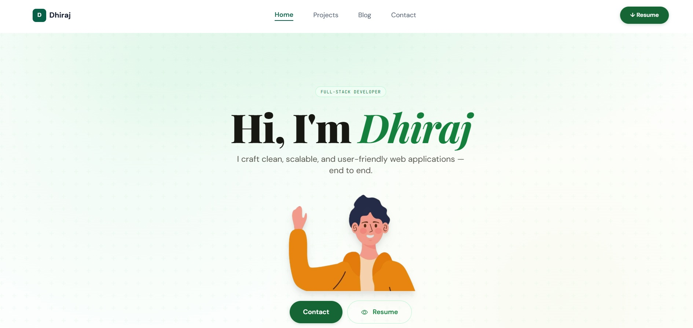
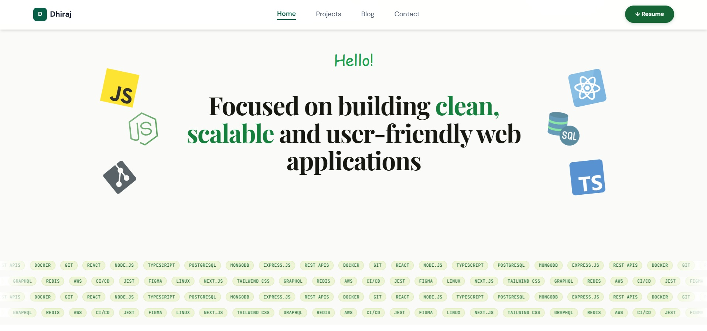

# React + Vite
# My Portfolio

A personal portfolio website showcasing projects, blog posts, and contact details — built with React, Vite and Tailwind CSS.

## Demo
- Live: (https://myportfolio-f4p3.onrender.com)

## Screnshots



## About
This portfolio highlights my work, technical skills, and the projects I'm proud of. It includes a clean, responsive layout with pages for Home, Projects, Blog, and Contact.

## Features
- Responsive design using Tailwind CSS
- Project gallery with details and links
- Blog listing page
- Contact form / contact details
- Lightweight, fast Vite-powered build

## Tech Stack
- React (JSX)
- Vite (dev tooling)
- Tailwind CSS (styling)
- Plain HTML/CSS for static parts

## Project Structure
- `src/` — React source files
	- `components/` — UI components (Navbar, Cards, Button, etc.)
	- `pages/` — Route pages (Home, Projects, Blog, Contact)
	- `assets/` — Images and fonts
- `public/` — Static assets

## Setup — Local Development
1. Install dependencies:

```bash
npm install
```

2. Run the dev server:

```bash
npm run dev
```

3. Open the app in your browser at the address shown by Vite (usually `http://localhost:5173`).

## Build & Preview
Create a production build:

```bash
npm run build
```

Preview the production build locally:

```bash
npm run preview
```

## Deployment
This site works well with static-hosting platforms such as Vercel, Netlify, and GitHub Pages. For Vercel, simply connect the repository and deploy the `main` branch — Vercel will detect Vite and set the correct build command (`npm run build`) and output directory (`dist`).

## Customization Tips
- Add or update projects in `src/pages/Projects.jsx` (or your projects data file).
- Place images in `public/images/` or `src/assets/` and reference them from components.
- Update fonts in `src/assets/fonts/` and Tailwind config if needed.

## Contributing
If you'd like help improving the portfolio (copy, styling, or features), open an issue or submit a PR with a short description of your change.

## Contact
- Email: your-email@example.com (replace with your email)
- LinkedIn / Twitter / GitHub: add your links

---
Made with ❤️ — feel free to ask me to tweak text, layout, or add sections (skills, testimonials, badges).
This template provides a minimal setup to get React working in Vite with HMR and some ESLint rules.

Currently, two official plugins are available:

- [@vitejs/plugin-react](https://github.com/vitejs/vite-plugin-react/blob/main/packages/plugin-react) uses [Babel](https://babeljs.io/) (or [oxc](https://oxc.rs) when used in [rolldown-vite](https://vite.dev/guide/rolldown)) for Fast Refresh
- [@vitejs/plugin-react-swc](https://github.com/vitejs/vite-plugin-react/blob/main/packages/plugin-react-swc) uses [SWC](https://swc.rs/) for Fast Refresh

## React Compiler

The React Compiler is not enabled on this template because of its impact on dev & build performances. To add it, see [this documentation](https://react.dev/learn/react-compiler/installation).

## Expanding the ESLint configuration

If you are developing a production application, we recommend using TypeScript with type-aware lint rules enabled. Check out the [TS template](https://github.com/vitejs/vite/tree/main/packages/create-vite/template-react-ts) for information on how to integrate TypeScript and [`typescript-eslint`](https://typescript-eslint.io) in your project.
