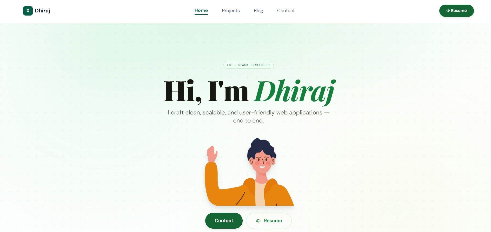
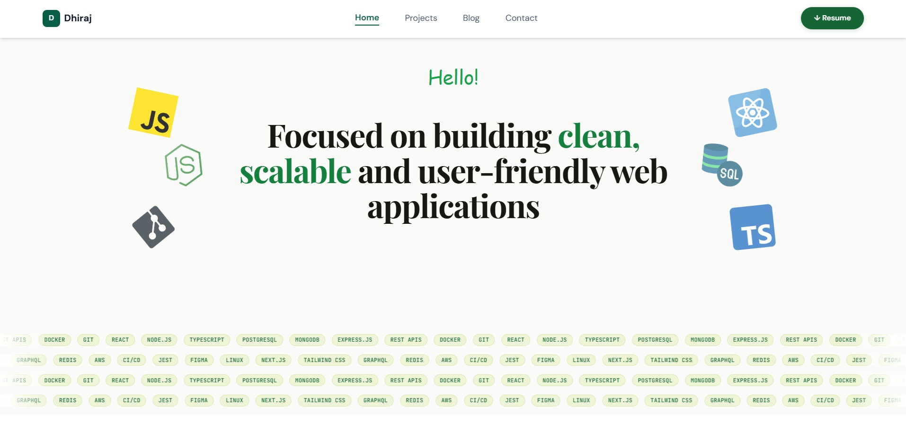

# My Portfolio

## A personal portfolio website showcasing projects, blog posts, and contact details.

# Demo
   - [App Link](https://my-portfolio-seven-mauve-96.vercel.app/)




## About
This portfolio highlights my work, technical skills, and the projects I'm proud of. It includes a clean, responsive layout with pages for Home, Projects, Blog, and Contact.

## 🎯 Features

- **Responsive Design** — Mobile-first approach using Tailwind CSS
- **Project Gallery** — Showcase of projects with descriptions and links
- **Blog Section** — Blog listing and post pages
- **Contact Page** — Easy-to-use contact form and contact information
- **Fast Performance** — Lightweight Vite-powered build with instant HMR

## 🛠️ Tech Stack

| Technology | Purpose |
|-----------|---------|
| **React** | UI framework |
| **Vite** | Build tool & dev server |
| **Tailwind CSS** | Styling & responsive design |
| **JavaScript (JSX)** | Application logic |

## 📁 Project Structure

```
myportfolio/
├── public/
│   └── images/          # Static images
├── src/
│   ├── components/      # Reusable UI components
│   │   ├── Button.jsx
│   │   ├── Cards.jsx
│   │   ├── Navbar.jsx
│   │   └── ...
│   ├── pages/           # Page components
│   │   ├── Home.jsx
│   │   ├── Projects.jsx
│   │   ├── Blog.jsx
│   │   ├── Contact.jsx
│   │   └── NotFound.jsx
│   ├── assets/          # Fonts and other assets
│   ├── App.jsx          # Main app component
│   └── main.jsx         # Entry point
├── package.json         # Dependencies and scripts
├── vite.config.js       # Vite configuration
└── tailwind.config.js   # Tailwind CSS configuration
```

## 🚀 Getting Started

### Prerequisites
- Node.js (v16 or higher)
- npm or yarn

### Installation

1. **Clone the repository**
   ```bash
   git clone <repository-url>
   cd myportfolio
   ```

2. **Install dependencies**
   ```bash
   npm install
   ```

3. **Start the development server**
   ```bash
   npm run dev
   ```

4. **Open in browser**
   
   Visit the URL shown in your terminal (typically `http://localhost:5173`)

## 🏗️ Building & Deployment

### Build for Production
```bash
npm run build
```

This generates an optimized production build in the `dist/` folder.

### Preview Production Build
```bash
npm run preview
```

### Deploy to Vercel

1. Push your repository to GitHub
2. Import the project in [Vercel](https://vercel.com)
3. Vercel automatically detects Vite and sets the correct build settings
4. Your site is live!

**Supported platforms:** Vercel, Netlify, GitHub Pages

## ✏️ Customization

- **Add Projects** — Edit or create project data in `src/pages/Projects.jsx`
- **Update Images** — Place images in `public/images/` and reference them in components
- **Modify Styles** — Update Tailwind configuration in `tailwind.config.js`
- **Change Fonts** — Add fonts to `src/assets/fonts/` and import in `src/index.css`

## 🤝 Contributing

Contributions and suggestions are welcome! Please feel free to:
- Open an issue for bugs or feature requests
- Submit a pull request with improvements
- Leave feedback on design or functionality

## 📧 Contact

- **Email:** (gdhiraj030@gmail.com)
- **LinkedIn:** [Your LinkedIn Profile](https://linkedin.com)
- **GitHub:** [Your GitHub Profile](https://github.com)
- **Twitter:** [Your Twitter Handle](https://twitter.com)

---

**Built with ❤️** | Feel free to fork and customize this portfolio for your own use!


